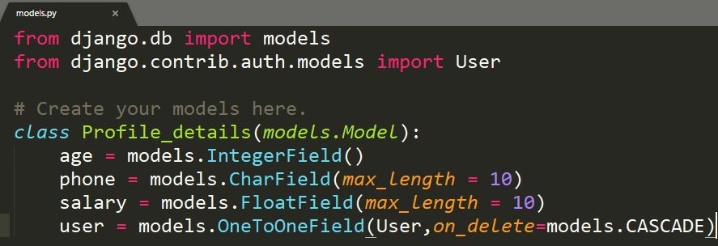
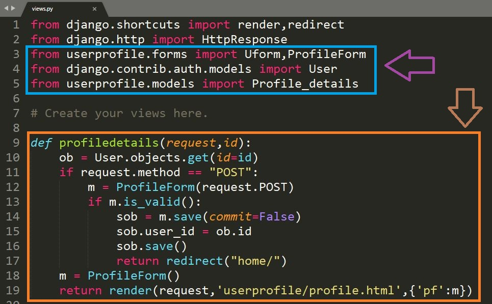

## User Profile Creation by using OneToOneField
  - Creation of Model
  - Creation of Form
  - Creation of URL
  - Creation of Function
  - Creation of .html
---
### Creation of Model:
  - After logging into **User Welcome page** we need to update some more fields that is not existing in the User model(i.e., when user is registering into our site) so for that purpose we are creating another model to update user profile when user is authenticated to login.
  - In previous topics we are aware of how to create a model and how to access it but for user logging we didn't created any model to register because we are migrating the default admin models to database.
  - So first step is to open the models.py in our app and then we need to import the default User model from admin so we are implementing some code to access the models <br/>
    #### ```models.py```
    ``` python
    from django.db import models
    from django.contrib.auth.models import User
    ```
  - By Default the models is accessed when migrate is done by user here ```django.db``` defines a models that is accessing from ```.db``` so we are not importing that line. Then we need to access default admin model by implementing ```django.contrib.auth.models``` in that we are accessing only the models class(i.e., User).
  - Next step is to implement whatever the fields we need to create for a user when he/she is logged in. So here we are creating some more fields that are not existing in ```User``` model class with another class name(i.e., userdefined classnames). We are implementing the class name as **Profile_details** with age,phone,salary,user etc., fields names in it.
  - Profile_details model class consisting of three fields i.e., 
    - age with IntegerField 
    - phone with CharField consisting of max_length = 10
    - salary with FloatField consisting with max_length = 10
    - user with OneToOneField consisting of User model class involving on_delete=models.CASCADE
  - Finally we created a model class with some fields as shown below
    #### ```models.py```
    ``` python
    from django.db import models
    from django.contrib.auth.models import User
    
    class Profile_details(models.Model):
          age = models.IntegerField()
          phone = models.CharField(max_length = 10)
          salary = models.FloatField(max_length = 10)
          user = models.OneToOneField(User,on_delete=models.CASCADE)
    ```
   - We are aware of types in **ORM** like IntegerField,CharField etc., for age we are not considering any max_length but we can restrict for max_length = 2 so for user requirement it is to be changes and in phone we are not defining IntegerField type because for that we need to access only integers with some limit upto 10 digits so to print the phone number in admin page in string format so for that purpose we are defining CharField for phone. salary consists with some decimal values so we are implementing it in FloatField. Last Field we are implementing in our model is user so here we are assigning OneToOneField so here the relation is single user access for single time insertion to his/her profile. Suppose user has to delete from our site for that we need to remove all record values so here we are using on_delete = models.CASCADE this can deletes the linking to particular user field values are to be deleted from the table.
   
   > **OneToOneField**: single user has to insert his/her details for single time insertion in a table

   > **on_delete=models.CASCADE**: Here we are removing entire record of a particular user from a table that should not exist in a table after removing a user. Suppose we are not using on_delete then the record in only User table is to be removed remaining table consisting of particular user values are exists so for that rectification we are using on_delete for removing not existing users values in tables.
   
   #### ```models.py screenshot```
   
   
   - After implementing model fields in models.py we need to do ```makemigrations``` because the fields we are creating for a particular table that can be viewed in the migrations folder with 0001.py files or how many times the migrations are done that can be increased with some numbering in it. If we need to check the fields with types that can be viewed in it.
   - Making migrations it can't effects database for creating a table with fields. So we need to do ```migrate``` here the table and fields are to be created in database that is implemented in models by user.
   - Here we are using model as **Profile_details** as tablename but the table name can be created as **database_modelclassname** it can be created like databasename with modelclassname.
     #### ```Command Prompt```
     ``` python
     python manage.py makemigrations 
     python manage.py migrate
     ```
     #### ```Screenshot of migrations and migrate```
     
     
     
   - After making migrations and migrate we can observe the tablenames with fields in **phpmyadmin** as shown below 
     #### ```Screenshot of model class with field names```
     
   - In above figure it shows tablenames and fields but in field structure we are not creating id with type. while creating a model by default it creates **id** for all the tables here we are linking the first table to this specified table by using OneToOneField.
   - The last field we are assuming is user in userdefined model but in mysql the filed is created as **user_id**. 'underscroll id' will attaches to every oneToOneField structure in models. 
 
---
### Creation of Form:
   - While model creation is done in mysql then we are proceeding for ```form creation``` whatever the fields that we are going to display and to enter the values to a tables in particular field.
   - We are aware of creating a form in our app that is created previously so in that we are creating a new class (i.e., as userdefined names here we are creating the form name as **ProfileForm**) for our newly created model class.
   - Before proceeding to create a class for userdefined form first we need to import the created model class to here for importing the model from models.py for that we are using ```from userprofile.models import Profile_details``` so here whatever the model we are giving for that we are creating a form so we need to import the ```ModelForm```
   - After importing we need to import the model class also for which model we are going to create a form. so for accessing that form we are importing form class to display a particular field by using model names so the form for creating modelsform as ```from django.forms import ModelForm```. By this class form we can create a user defiend form values that is to be displayed in .html file
   - Finally the importing in forms.py looks like below.
     #### ```Importing model and modelform in forms.py``` 
     ``` python
     from django.forms import ModelForm
     from userprofile.models import Profile_details
     ```
   - So we need to create a userform class for inputting the specified values to models.
     #### ```Form class creation in forms.py```
     ``` python
     class ProfileForm(ModelForm):
         class Meta:
             model = Profile_details
             fields = ['age','phone','salary']
     ```
   - In above code implementation we are not using **id** and **user_id** because it ishould be automatically set to their default states such as **id** is primary key in the table and **user_id** is foreign key that should be inserted automatically when specific user is logged into their profile. 
   - We are not using **__ all __** because we should not enter the id and user_id field values if we are assiging as **__ all __** in fields we need to select the user when the form is displaying. so it creates a duplicates for all the users so we can't specify user details when searching in database tables.
   - Finally the forms.py looks like shown below.
     #### ```Screenshot forms.py```
       
  ---  
  ### Creation of URLs:
   - After completing the ```models.py``` and ```forms.py``` we are going to implement URL for which url we are accessing the form. so previuosly we are aware of creating a url for other models or functions to redirect through .htmls first we need to pass url for particular function that can be performing with some operations.
     #### ```urls.py```
     ``` python
     path('profile/<int:id>',views.profiledetails,name="profile"),
     ```
   - In url path we know the path parameters such as first parameter is url with specific user id that can be typed in browser to view particular user details second parameter is function that can be implemented in ```views.py``` and the last parameter is name that can be accessed wherever the url should be called for redirection.
   - finally the ```urls.py``` will be looks like shown below
     #### ```Screenshot Urls.py```
     
  ---
  ### Creation of Function in Views:
   - Here we are creating a function in views.py we know that how we are going to create a fucntion in views after completion of creating model in ```models.py``` and form in ```forms.py```.
   - In views first we need to import our **model class** and **form class** after importing then we can proceed for creating a function because we need to access those model class for getting **id** from User table that is created earlier. Form class is used to insert the values to our model getting from the user end(i.e., entering data in .html file)
     #### ```Importing model and form class in view.py```
     ```python
     from userprofile.forms import Uform,ProfileForm
     from django.contrib.auth.models import User
     ```
   - From importing we already imported the userform(i.e., Uform) that is already imported previously so we are including along with same path for importing the **ProfileForm** to display it in .html file and to post the data to a model.
     #### ```Screenshot of importing model and form class in views.py```
     
   - Now we are going to create a function (i.e.,profiledetails) in that we are passing two parameters that is **request** from user and **id** which user is to be updating his/her record. So if the user is not updated these given form details then the form has to be visible if user is inserted then the form can be dispayed as updated form.
   - By passing those details from user i.e., **id** that should match from the previous table **id** (i.e., user logged in id). Then we are going to implement logic to insert the data to the form first we need to access the first table objects that should be stored in an object.
   - After storing the first table values in object then we are going to check whether the request is either "GET" or "POST". If the request is "GET" then we need to update those fields or else it is in "POST" format. If we are storing those data by using the Modelform with a variable so we need to check whether it is a valid data or not.
   - If the data is valid or not we need to use ```is_valid()``` if it is valid then we are accessing another object to store it because we are storing only "age,phone,salary" including that fields we are assigning the linking from previous table so we already created another field with "OneToOneField" i.e., ```user```.
   - In present table it can creates as user_id for that we are not filling any data to it for that we are pausing the saving data to table. we need to link ```id``` from User table and ```user_id``` from present table then it stores only single data insertion for single user
   - Then we need to store the form data to table by passing the command to an object ie., ```object.save()``` if the user has "GET" request then the object is to be passed for the form in dictioanry format as previous discussed in above topics.
   - Finally the views.py will have function such as shown below
     #### ```views.py```
     ```python
     def profiledetails(request,id):
        ob = User.objects.get(id=id)
        if request.method == "POST":
            m = ProfileForm(request.POST)
            if m.is_valid():
                sob = m.save(commit=False)
                sob.user_id = ob.id
                sob.save()
                return redirect("home/")
        m = ProfileForm()
        return render(request,'userprofile/profile.html',{'pf':m})
     ```        
     #### ```Screenshot views.py```
     
